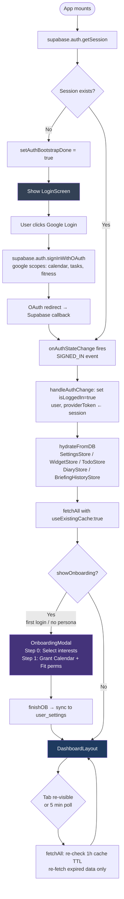
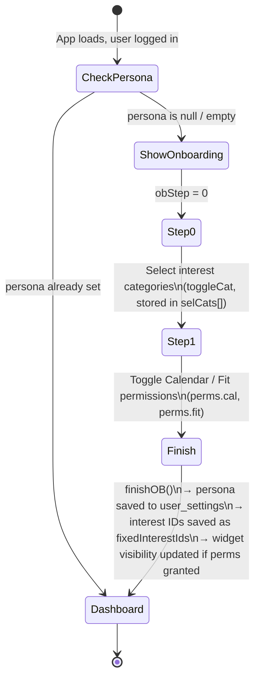
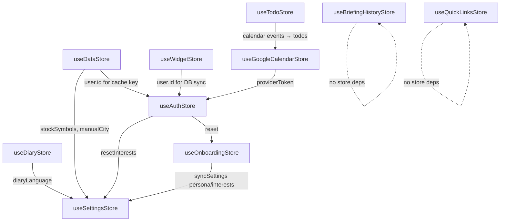
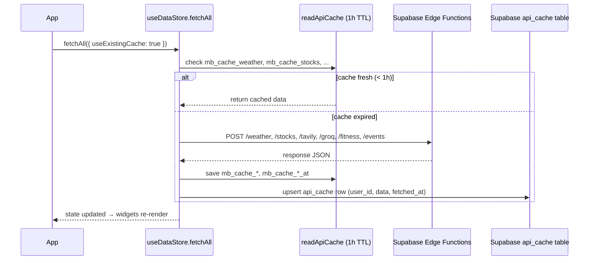

# MorningBriefing.AI — Architecture Overview

> A new team member should be able to understand the end-to-end flow in ≤ 30 minutes.
> Last updated: 2026-05-24

---

## Table of Contents

1. [High-Level Architecture](#1-high-level-architecture)
2. [Auth Flow Diagram](#2-auth-flow-diagram)
3. [Onboarding Flow](#3-onboarding-flow)
4. [Store Dependency Map](#4-store-dependency-map)
5. [Data Fetch Pipeline](#5-data-fetch-pipeline)
6. [Supabase Edge Functions](#6-supabase-edge-functions)
7. [Directory Structure](#7-directory-structure)

---

## 1. High-Level Architecture

```
Browser
│
├── React SPA (Vite + TypeScript)
│   ├── Zustand stores  ←─ single source of truth per domain
│   ├── React.lazy widgets  ←─ code-split, loaded on demand
│   └── Service layer  ←─ calls Edge Functions, formats AI output
│
├── Supabase (BaaS)
│   ├── Auth  ←─ Google OAuth
│   ├── Postgres + RLS  ←─ user data (8 tables)
│   └── Edge Functions (Deno)  ←─ secret-holding API proxy (8 functions)
│
└── External APIs (all behind Edge Functions, secrets never in browser)
    ├── Google Calendar / Tasks / Fit  (OAuth-gated)
    ├── OpenWeatherMap
    ├── TwelveData / Yahoo / Stooq  (stocks)
    ├── Tavily Search
    └── Groq LLM
```

---

## 2. Auth Flow Diagram



### Key rules

| Condition | Behaviour |
|-----------|-----------|
| `supabase` is `null` (no env vars) | Offline mode — `authBootstrapDone` set immediately from `mb_login` localStorage |
| React StrictMode double-mount | `initPhaseRef` guard ensures `fetchAll` fires exactly once per login phase |
| Tab re-focus / 5-min interval | `fetchAll({ useExistingCache: true })` — 1 h TTL checked in `readApiCache`; expired items re-fetched, fresh items served from cache |
| Logout | `isLoggedIn=false`, all Zustand state cleared, `mb_login=false` in localStorage |

---

## 3. Onboarding Flow



`useOnboardingStore.finishOB()` → calls `useSettingsStore.syncSettings({ persona, fixed_interests, onboarding_perms })` → upserts to `public.user_settings`.

---

## 4. Store Dependency Map



### Store responsibilities

| Store | Owns | Persists to |
|-------|------|-------------|
| `useAuthStore` | Login state, `user`, `providerToken` | `mb_login` (localStorage) + Supabase Auth |
| `useSettingsStore` | Theme, tone, clock, stocks list, pin mode | `mb_theme` etc. (localStorage) + `user_settings` (Supabase) |
| `useDataStore` | Weather, stocks, news, trends, health, briefing | `mb_cache_*` (localStorage) + `api_cache` (Supabase) |
| `useWidgetStore` | Dashboard layout, widget visibility, font size | `mb_layouts` (localStorage) + `widget_layouts` (Supabase) |
| `useTodoStore` | Today's todo list (merged from Google Tasks) | `mb_todos` (localStorage) |
| `useDiaryStore` | Diary entries, Q&A answers, PIN management | `mb_diary_entries` (localStorage) + `diaries` / `user_qa` (Supabase) |
| `useOnboardingStore` | Onboarding wizard state, selected categories | `user_settings` (Supabase) via `useSettingsStore` |
| `useGoogleCalendarStore` | Google Calendar events + Tasks | `mb_calendar_events`, `mb_google_tasks` (localStorage) |
| `useBriefingHistoryStore` | Briefing snapshot history (30 days) | `mb_briefing_history` (localStorage) |
| `useQuickLinksStore` | User-saved quick-access URLs | `mb_quick_links` (localStorage) |

---

## 5. Data Fetch Pipeline

`useDataStore.fetchAll()` is the central data orchestrator. It fans out to all Edge Functions in parallel:



Cache keys written: `mb_cache_weather`, `mb_cache_stocks`, `mb_cache_news`, `mb_cache_trends`, `mb_cache_health`, `mb_cache_briefing`, each paired with `mb_cache_*_at` (timestamp).

---

## 6. Supabase Edge Functions

All 8 functions live in `supabase/functions/<name>/index.ts`.  
Deployed at `https://<project-ref>.supabase.co/functions/v1/<name>`.  
All accept `POST` with a JSON body; CORS headers allow the Vite dev origin.

| Function | Trigger | Purpose | Request (key fields) | Response (key fields) | External API | Secrets used |
|----------|---------|---------|---------------------|----------------------|-------------|--------------|
| `weather` | POST | Current weather + air quality for a location | `lat`, `lon`, `city` | `temp`, `feels_like`, `humidity`, `condition`, `icon`, `city`, `precipitation`, `airQuality` | OpenWeatherMap | `OPENWEATHER_API_KEY` |
| `stocks` | POST | Stock / index / currency quotes with fallback chain | `symbols[]` (default: KOSPI, NASDAQ, SP500, USDKRW) | `[{ symbol, price, change, changePercent, type, currency }]` | TwelveData → Yahoo Finance → Stooq → exchange-rates | `TWELVEDATA_API_KEY` |
| `tavily` | POST | Web search / news / trending topics | `query`, `mode` ("trends"\|"news"\|"search"), `max_results`, `location`, `time_range` | `{ trends[], answer, results[{ title, url, content, published_date, score, image }] }` | Tavily Search API | `TAVILY_API_KEY` |
| `groq` | POST | LLM text generation (briefing, diary, Q&A) | `prompt`, `system?`, `model?`, `temperature?` | `{ text }` | Groq API (llama-3.3-70b-versatile default) | `GROQ_API_KEY` |
| `events` | POST | Google Calendar CRUD | `token` (Google OAuth), `action` ("list"\|"create"\|"update"\|"delete"\|"read"), event fields | Event object `{ id, title, start, end, allDay, location, meetLink, recurrence, ... }` | Google Calendar v3 | — (uses OAuth token from client) |
| `tasks` | POST | Google Tasks CRUD | `token`, `action` ("list"\|"create"\|"update"\|"delete"\|"move"\|"clearCompleted"), task fields | Task object `{ id, taskListId, title, notes, due, status, completed, ... }` | Google Tasks v1 | — (uses OAuth token) |
| `fitness` | POST | Daily fitness metrics from Google Fit | `token` (Google OAuth) | `{ steps, calories, heartRate, sleep }` | Google Fit REST API v1 | — (uses OAuth token) |
| `smart-widget` | POST | AI-powered keyword → widget content routing | `keyword`, `persona?`, `token?`, `lat?`, `lon?` | `{ keyword, emoji, lastUpdated, sections[{ type, title, bullets?, tags?, items? }], debug }` | Groq + Tavily + OpenWeatherMap + TwelveData + Google Calendar + Google Fit | `GROQ_API_KEY`, `TAVILY_API_KEY`, `OPENWEATHER_API_KEY`, `TWELVEDATA_API_KEY` |

### Calling convention from the browser

All Edge Function calls go through `useDataStore` → `src/services/aiService.ts`:

```ts
// Pattern used throughout the app
const res = await fetch(`${supabaseUrl}/functions/v1/<name>`, {
  method: "POST",
  headers: {
    "Content-Type": "application/json",
    "Authorization": `Bearer ${supabaseAnonKey}`,
  },
  body: JSON.stringify(payload),
});
```

The `Authorization: Bearer <anon-key>` header is required by Supabase; the anon key is public and scoped only to what RLS policies permit.

---

## 7. Directory Structure

```
src/
├── App.tsx                  # Root: auth bootstrap, fetchAll orchestration, modal lazy-loading
├── components/
│   ├── layout/
│   │   ├── TopNav.tsx       # Language toggle, modals trigger
│   │   ├── DashboardLayout.tsx  # 1:3:3 grid, React.lazy widget loading
│   │   └── LoginScreen.tsx  # Google OAuth sign-in button
│   ├── modals/
│   │   ├── OnboardingModal.tsx  # 2-step onboarding wizard
│   │   ├── SettingsModal.tsx
│   │   ├── WidgetSettingsModal.tsx
│   │   └── FirstLoginBriefingModal.tsx
│   └── widgets/
│       ├── BriefingWidget.tsx   # Daily AI briefing with voice
│       ├── WeatherWidget.tsx    # Weather + air quality card
│       ├── StocksWidget.tsx     # Stock quotes with sparkline
│       ├── CalendarWidget.tsx   # Google Calendar events
│       ├── NewsWidget.tsx       # Tavily news feed
│       ├── TrendsWidget.tsx     # Trending topics
│       ├── HealthWidget.tsx     # Google Fit metrics
│       ├── DiaryCard.tsx        # Daily Q&A diary
│       └── SmartWidgetContent.tsx  # AI dynamic keyword widget
├── store/                   # Zustand stores (see §4)
├── services/
│   ├── aiService.ts         # Edge Function call wrappers + briefing generation
│   ├── diaryGenerationService.ts  # AI diary synthesis at midnight
│   └── personalizationService.ts  # Interest scoring + keyword bump
├── hooks/
│   ├── useMidnightTrigger.ts  # Daily reset + diary synthesis at midnight
│   ├── useTheme.ts
│   └── useFontSize.ts
├── lib/
│   └── supabase.ts          # SupabaseClient with secureStorage adapter (strips provider_token)
├── utils/
│   ├── storage.ts           # localStorage load/save wrappers
│   ├── errorHandler.ts      # Standardized ApiError + handleApiError
│   └── date.ts              # formatLocalDate, timezone-safe helpers
├── types/
│   └── index.ts             # Shared TypeScript types
└── l10n/
    └── i18n.ts              # react-i18next setup (ko / en)

supabase/
├── functions/               # Edge Functions (Deno) — see §6
├── schema.sql               # Full DB schema with RLS + policies
└── migrations/              # Incremental ALTER TABLE migrations
```

---

## Quick Reference: Where does X live?

| Question | Answer |
|----------|--------|
| Where is the Google login button? | `src/components/layout/LoginScreen.tsx` |
| Where is the auth session loaded? | `App.tsx` → `supabase.auth.getSession()` + `onAuthStateChange` |
| Where is the daily data fetched? | `useDataStore.fetchAll()` called from `App.tsx` |
| Where are API secrets? | `.env` (server-side only, no `VITE_` prefix) + Supabase Edge Function env |
| Where is the 1-hour cache TTL? | `useDataStore.readApiCache()` — checks `mb_cache_*_at` in localStorage |
| Where is the midnight diary generated? | `useMidnightTrigger.ts` → `diaryGenerationService.ts` → `aiService.generateDiary` |
| Where does onboarding save data? | `useOnboardingStore.finishOB()` → `useSettingsStore.syncSettings()` → `user_settings` |
| Where is provider_token stored? | Memory only (`useAuthStore.providerToken`); stripped from localStorage by `secureStorage` adapter in `src/lib/supabase.ts` |
