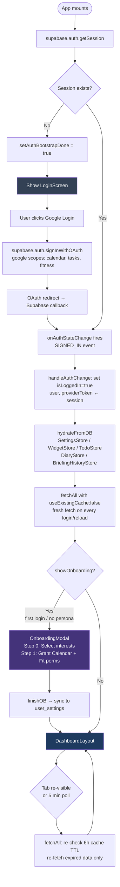
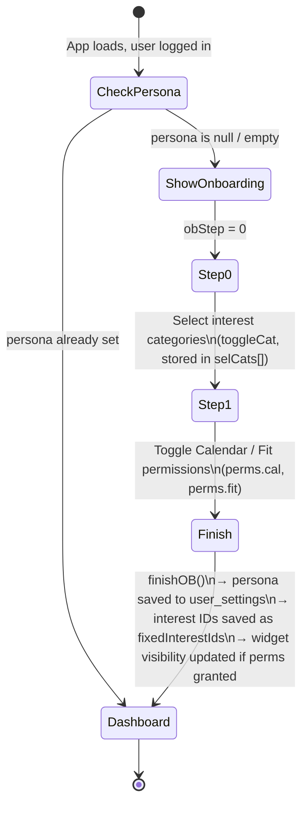
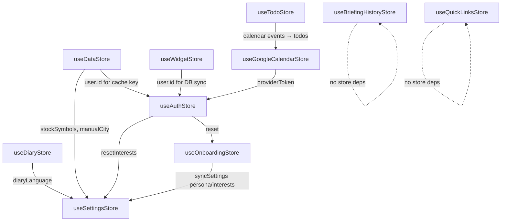
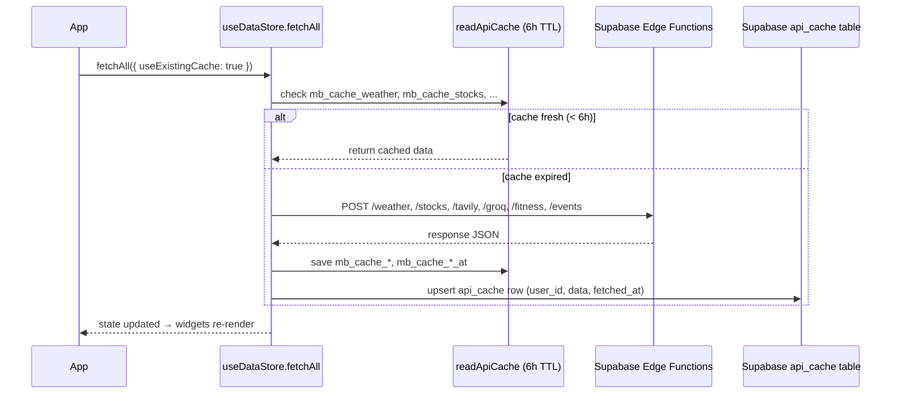

# MorningBriefing.AI — Developer Reference

> Last updated: 2026-10-04
> Single source of truth for architecture. Quick agent/contributor guide → [AGENTS.md](./AGENTS.md). Open work → [docs/BACKLOG.md](./docs/BACKLOG.md). Change log → [CHANGELOG.md](./CHANGELOG.md).
> Architecture diagrams (auth flow, onboarding, store map, fetch pipeline) inlined in §4–§6. Original standalone file archived at [archive/course/ARCHITECTURE.md](./archive/course/ARCHITECTURE.md).

---

## Table of Contents

1. [Project Overview](#1-project-overview)
2. [Tech Stack](#2-tech-stack)
3. [Directory Structure](#3-directory-structure)
4. [App Initialization Flow](#4-app-initialization-flow)
5. [State Management](#5-state-management)
6. [Caching Strategy](#6-caching-strategy)
7. [Widget System](#7-widget-system)
8. [Modals](#8-modals)
9. [Edge Functions](#9-edge-functions)
10. [Database Schema](#10-database-schema)
11. [Personalization Logic](#11-personalization-logic)
12. [Utilities / Hooks / Constants](#12-utilities--hooks--constants)
13. [Internationalization](#13-internationalization)
14. [Supabase Setup](#14-supabase-setup)
15. [Operations Checklist](#15-operations-checklist)
16. [Known Issues](#16-known-issues)
17. [Quick Reference](#17-quick-reference)

---

## 1) Project Overview

**MorningBriefing.AI** is a browser new-tab dashboard that aggregates a user's daily context (weather, stocks, news, trends, calendar, health, diary/Q&A) into an AI briefing and a personal diary flow.

**Core goals:**
1. Surface relevant information on a single screen
2. Cache-first rendering to minimize perceived load time
3. Securely store per-user settings and data (RLS-isolated)
4. Personalized news + AI briefing based on user interests

**Core principles:**
1. API failures fall back to mock data — no UX breakage
2. User data isolation via Supabase Row-Level Security
3. Secret keys managed exclusively in Supabase Secrets (never in client code)

### 1.1 System Architecture

```text
Browser
│
├── React SPA (Vite + TypeScript)
│   ├── Zustand stores  ←─ single source of truth per domain
│   ├── React.lazy widgets  ←─ code-split, loaded on demand
│   └── Service layer  ←─ calls Edge Functions, formats AI output
│
├── Supabase (BaaS)
│   ├── Auth  ←─ Google OAuth
│   ├── Postgres + RLS  ←─ user data (8 tables)
│   └── Edge Functions (Deno)  ←─ secret-holding API proxy (9 functions)
│
└── External APIs (all behind Edge Functions, secrets never in browser)
    ├── Google Calendar / Tasks / Fit  (OAuth-gated)
    ├── Google OAuth token refresh  (google-refresh)
    ├── OpenWeatherMap
    ├── TwelveData / Yahoo / Stooq  (stocks)
    ├── Tavily Search
    └── Groq LLM

(Google Maps Places JS API loads directly in the browser via VITE_GOOGLE_MAPS_API_KEY — location autocomplete only, not behind an Edge Function.)
```

---

## 2) Tech Stack

### Frontend

| Library | Version | Purpose |
|---------|---------|---------|
| TypeScript | 5 | Language (`.ts` / `.tsx`); full migration 2026-05-24; `tsconfig.json strict: true`. `npm run build` runs `tsc -b && vite build`; `npm run typecheck` = `tsc --noEmit` |
| React | 18 | UI framework (entry: `src/main.tsx` → `App.tsx` in `React.StrictMode`) |
| Vite | 6 | Build tool |
| Tailwind CSS | 3 | Styling |
| Zustand | 5 | State management (10 stores; `useOnboardingStore` extracted 2026-05-24) |
| framer-motion | 12 | Animation |
| three | 0.184 | WebGL shader animation for the login background (`FloatingLines.tsx`) |
| @hello-pangea/dnd | 17 | Drag-and-drop (stock reorder, layout) |
| react-hot-toast | 2 | Toast notifications |
| lucide-react | — | Icon set |
| i18next / react-i18next | 24 / 15 | Korean / English i18n |
| Google Maps Places JS API | weekly | Location autocomplete (`src/lib/googleMaps.ts`, `GooglePlacesLocationField.tsx`) |
| `src/utils/errorHandler.ts` | — | `ErrorType`, `classifyApiError()`, `handleApiError(err, context, {userVisible, httpStatus})` — logs via `console.warn`, toasts only when `userVisible` |

### Backend / Infra

| Service | Purpose |
|---------|---------|
| Supabase (Auth, Postgres, Edge Functions) | Auth, DB, serverless API |
| OpenWeatherMap + Groq | Weather data |
| Twelve Data | Stock quotes |
| Tavily | News and trends |
| Google Calendar API | Calendar events and tasks |
| Google Fitness API | Health data (steps, sleep, calories) |
| Groq (LLM) | AI briefing generation, diary generation, keyword extraction |

---

## 3) Directory Structure

```text
src/
  main.tsx                        # React entry — renders <App/> in StrictMode, imports l10n/i18n
  App.tsx                         # App shell, auth bootstrap, initialization, ExtensionInstallBanner
  index.css                       # Global Tailwind + base styles
  vite-env.d.ts                   # Vite client type declarations
  types/
    index.ts                      # Shared TypeScript type definitions
  constants/
    index.ts                      # CATEGORIES, WIDGET_LIST, FIXED/STANDARD_WIDGETS, DEFAULT_VIS, DEFAULT_LAYOUTS, DEFAULT_PRIORITY_ORDER
  components/
    banners/
      ExtensionInstallBanner.tsx  # Top banner prompting Chrome extension install (dismissible, hidden inside extension)
    common/
      ConfirmDialog.tsx
      DragHandle.tsx
      FloatingLines.tsx           # three.js WebGL shader animation (login background)
      FloatingLines.css           # Container styles for FloatingLines
      GooglePlacesLocationField.tsx  # Google Maps Places autocomplete input
      TimeInput.tsx
      Toggle.tsx
      WidgetCard.tsx              # Shared card wrapper for all widgets
    layout/
      DashboardLayout.tsx         # 3-column layout with slide panel
      DatePanelContainer.tsx      # Events/Tasks/Diary container for selected date
      DiaryPanel.tsx
      EventPanel.tsx
      FixedButtons.tsx
      LoginScreen.tsx             # Google login screen (FloatingLines background)
      QuickLinks.tsx
      TaskPanel.tsx
      TopNav.tsx                  # Language toggle, settings button, profile
    modals/
      DiaryListModal.tsx
      FirstLoginBriefingModal.tsx
      OnboardingModal.tsx
      PINModal.tsx
      SettingsModal.tsx           # 7-tab settings hub (widgets/smart/priority/briefing/interests/diary/profile)
      WidgetSettingsModal.tsx
    widgets/
      BriefingSectionsView.tsx    # Shared presentational sections renderer (BriefingWidget + FirstLoginBriefingModal); exports BriefingSkeleton
      BriefingWidget.tsx
      CalendarWidget.tsx
      DiaryCard.tsx
      HealthWidget.tsx
      NewsWidget.tsx
      SmartWidgetContent.tsx
      StocksWidget.tsx
      TrendsWidget.tsx
      WeatherWidget.tsx
  hooks/
    useBriefingContext.ts         # Shared briefing context builder
    useFontSize.ts                # globalFontSize → {body, title, key} inline style objects (multiplier arg)
    useMidnightTrigger.ts         # Runs once on login: diary synthesis + todo reset
    useTheme.ts                   # Theme CSS class utilities
  l10n/
    i18n.ts                       # i18next config, language-change event emission
    index.ts                      # Re-exports default i18n + changeLanguage/getCurrentLanguage
    ko.json
    en.json
  lib/
    supabase.ts                   # Supabase client init + secureStorage adapter (strips provider_refresh_token)
    googleMaps.ts                 # Google Maps Places JS API loader + place-label helpers
  services/
    aiService.ts                  # Groq LLM calls (briefing, diary generation, diary rewrite, smart-widget)
    diaryGenerationService.ts     # Diary context builder + generateAndSaveDiaryForDate
    personalizationService.ts     # runPersonalizationBatch() — keyword extraction + 30-day decayed scoring
  store/
    useAuthStore.ts
    useBriefingHistoryStore.ts    # Time-stamped briefing snapshots (localStorage + Supabase)
    useDataStore.ts               # Weather/stocks/news/trends/health/calendar fetch + cache (inline mock fallbacks)
    useDiaryStore.ts
    useGoogleCalendarStore.ts     # Google Calendar/Tasks sync + local fallback
    useOnboardingStore.ts         # Onboarding state (step, perms flow) — extracted 2026-05-24
    useQuickLinksStore.ts
    useSettingsStore.ts
    useTodoStore.ts
    useWidgetStore.ts
  utils/
    contentUtils.ts               # cleanContent() — strips markdown/hashtags/SNS boilerplate
    date.ts                       # formatLocalDate(), shiftDateString() — local-time date utils
    errorHandler.ts               # ErrorType + classifyApiError() + handleApiError() — central error surface
    eventRepeat.ts                # RRULE build/parse + localized repeat labels for calendar events
    interests.ts                  # Fixed + dynamic interest management utilities
    personaContext.ts             # buildPersonaContext() for Groq prompts
    storage.ts                    # load() / save() localStorage wrappers
    taskRecurrence.ts             # Task date filtering and materialization

supabase/
  config.toml                     # Supabase CLI project config
  migrations/                     # timestamped; applied with `npx supabase db push`
    20260501000000_base_schema.sql          # Base table definitions
    20260502000000_add_personalization.sql  # diaries, keyword_score_log, keyword_interests columns
    20260513000000_add_fixed_interests.sql  # fixed_interests, onboarding_perms columns
    20260520000000_add_user_qa.sql          # user_qa table
    20261004000000_add_briefing_snapshots.sql # briefing_snapshots table
    20261005000000_add_google_tokens.sql    # google_tokens table
    20261005000100_revoke_anon_grants.sql   # revoke anon table privileges
    20261005000200_drop_todos.sql           # drop unused todos table
  functions/
    events/    fitness/   google-refresh/   groq/
    stocks/    tasks/     tavily/            weather/
```

> **Note:** `src/mock/data.ts` was removed — API-failure fallbacks are now defined inline inside `useDataStore.ts` fetch functions. There is no `kakao-places` Edge Function (removed); `google-refresh` was added for Google OAuth token renewal.

---

## 4) App Initialization Flow

### Auth Flow Overview



**Key rules:**

| Condition | Behaviour |
|-----------|-----------|
| `supabase` is `null` (no env vars) | Offline mode — `authBootstrapDone` set immediately from `mb_login` localStorage |
| React StrictMode double-mount | `initPhaseRef` guard ensures `fetchAll` fires exactly once per login phase |
| Tab re-focus / 5-min interval | `fetchAll({ useExistingCache: true })` — 6h TTL checked in `readApiCache`; expired items re-fetched, fresh items served from cache |
| Logout | `isLoggedIn=false`, all Zustand state cleared, `mb_login=false` in localStorage |

### Phase 1 — Auth Bootstrap

```
mount
  └─ getSession() explicit call        ← prevents race condition
  └─ onAuthStateChange subscription
  └─ handleAuthChange(session)
  └─ authBootstrapDone = true
```

### Phase 2 — Post-Login Data Initialization

Condition: `isLoggedIn=true && user.id` present

```
runFullInit()                                         (src/App.tsx)
  └─ only if openedFromOAuthRedirect (src/lib/supabase.ts — page opened by the Google sign-in callback):
       localStorage.removeItem("mb_last_fetched_at" / "mb_last_access_time") + lastFetchedAt reset
       → forces a fresh fetch right after sign-in
  └─ hydrateFromDB() → parallel load of settings/widgets/todos/diary/briefingHistory
       + waitForUserSettings() (interests + calendar/fit perms from useAuthStore.loadUserSettings)
  └─ fetchAll({ useExistingCache: false })  ← stale check: last access < 6h → reads api_cache (plain reloads)
       concurrent fetchAll calls share one in-flight run
  └─ useMidnightTrigger → runs once: lazy diary synthesis for missed days + todo reset

handleAuthChange()                                    (src/store/useAuthStore.ts)
  └─ user_settings row exists → runPersonalizationBatch()   ← 30-day keyword decay (today-guarded)
  └─ no user_settings row     → setShowOnboarding(true)     ← first login
```

Fallback: if `user.id` is delayed, runs `fetchAll({ useExistingCache: false })` solo after 1200ms timeout.

> **Note on "last updated" display:** `markFetched(key, dbCached.fetchedAt)` stamps the original DB-cache timestamp into localStorage. Resetting `mb_last_fetched_at` on login ensures the displayed "X분 전" always reflects the current session's fetch, not a previous session's stale value.

### Phase 3 — Periodic Refresh

| Trigger | Target | Mechanism |
|---------|--------|-----------|
| Tab visibility return | All | `visibilitychange` → `fetchAll({ useExistingCache: true })` (6h TTL, `CACHE_THRESHOLD_MS`) |
| 5-minute poll | All | `setInterval` (visible tab only) |
| Manual refresh | Individual widget | `force=true` bypasses cache |
| Language change | News + Trends + Smart Widget | `i18n.on("languageChanged")` module-level listener |
| Interest change | News only | `useSettingsStore.subscribe()` fingerprint diff |
| Midnight | Auto-diary synthesis | `useMidnightTrigger` — runs once on login |
| 3-hour auto | AI Briefing | `setInterval(3h)` in `BriefingWidget`; also regenerates on tone/language change and once when tomorrow's events arrive |

### Guest mode (no sign-in)

"Explore without signing in" on the login screen calls `enterGuestMode()` (`src/demo/demoData.ts`, lazy chunk):
sets the `src/lib/guest.ts` flag, injects sample data into the stores with `setState` (never `save()`), and sets
`isLoggedIn: true`. While the flag is set, the Edge Function helpers, `fetch*` actions, `fetchAll`,
`loadSmartWidget`, `ensureProviderToken`, briefing-snapshot saving and the todo cache/daily reset all return early,
so there is no network traffic and nothing reaches a real user's localStorage. `logout()` reloads the page, which
clears the in-memory flag. `GuestBanner` links to Google sign-in.

### Onboarding Flow



`useOnboardingStore.finishOB()` → calls `useSettingsStore.syncSettings({ persona, fixed_interests, onboarding_perms })` → upserts to `public.user_settings`.

---

## 5) State Management

Ten Zustand stores. All use localStorage for persistence unless noted.

### Store Dependency Map



**Store responsibilities:**

| Store | Owns | Persists to |
|-------|------|-------------|
| `useAuthStore` | Login state, `user`, `providerToken` | `mb_login` (localStorage) + Supabase Auth |
| `useSettingsStore` | Theme, tone, clock, stocks list, pin mode | `mb_theme` etc. (localStorage) + `user_settings` (Supabase) |
| `useDataStore` | Weather, stocks, news, trends, health, briefing | `mb_cache_*` (localStorage) + `api_cache` (Supabase) |
| `useWidgetStore` | Dashboard layout, widget visibility, font size | `mb_layouts` (localStorage) + `widget_layouts` (Supabase) |
| `useTodoStore` | Today's todo list (merged from Google Tasks) | `mb_todos` (localStorage) |
| `useDiaryStore` | Diary entries, Q&A answers, PIN management | `mb_diary_entries` (localStorage) + `diaries` / `user_qa` (Supabase) |
| `useOnboardingStore` | Onboarding wizard state, selected categories | `user_settings` (Supabase) via `useSettingsStore` |
| `useGoogleCalendarStore` | Google Calendar events + Tasks | `mb_calendar_events`, `mb_google_tasks` (localStorage) |
| `useBriefingHistoryStore` | Briefing snapshot history (30 days) | `mb_briefing_history` (localStorage) |
| `useQuickLinksStore` | User-saved quick-access URLs | `mb_quick_links` (localStorage) |

### 5.1 useAuthStore

| Field | Type | Storage |
|-------|------|---------|
| `isLoggedIn` | boolean | localStorage |
| `onboarded` | boolean | localStorage |
| `user` | `{id, email, displayName, avatarUrl}` | memory |
| `providerToken` | string \| null | **memory only** (never localStorage — XSS risk) |
| `selCats` | string[] | DB (`user_settings.fixed_interests`) |
| `perms` | `{fit, cal}` | DB (`user_settings.onboarding_perms`) |
| `persona` | string | DB (`user_settings.persona`) |

**Key actions:** `login()` (Google OAuth, `prompt:"select_account"`, `access_type:"offline"`), `logout()`, `handleAuthChange(session)`, `ensureProviderToken(forceRefresh?)`, `loadUserSettings()`, `finishOB()`.

> **`ensureProviderToken(forceRefresh?)`** — memory token (if not past its tracked expiry) → session `provider_token` (only within ~55 min of `last_sign_in_at`) → `google-refresh {action:"refresh"}` (server-stored refresh token). `forceRefresh: true` skips the first two. If all fail and the user has calendar/fit perms, sets `googleReconnectNeeded` (banner → `reconnectGoogle()` = OAuth with `prompt=consent` so Google issues a new refresh token). On sign-in, `handleAuthChange` sends `session.provider_refresh_token` to `google-refresh {action:"store"}` once (§9).

---

### 5.2 useSettingsStore

| Field | Type | Storage |
|-------|------|---------|
| `theme` | `"dark"\|"light"` | localStorage |
| `bgImage` | string \| null | localStorage |
| `clockStyle` | `"digital"\|"analog"` | localStorage |
| `tempUnit` | `"c"\|"f"` | localStorage |
| `stockSymbols` | string[] | localStorage | User-added custom tickers (default `["KOSPI","NASDAQ","SP500","USDKRW"]`). |
| `fixedIndexSymbols` | string[] | localStorage | 8 hardcoded indices (`["SP500","KOSPI","NASDAQ","USDKRW","VIX","CRUDE","DXY","DJI"]`); user can drag-reorder in the modal but cannot add or remove. |
| `tone` | `"friendly"\|"formal"\|"casual"` | localStorage (default `"friendly"`) |
| `showFirstLoginBriefing` | boolean | localStorage + DB (first-login briefing toggle) |
| `priorityOrder` | string[] | localStorage |
| `fixedInterestIds` | string[] | DB (`user_settings.fixed_interests`) |
| `keywordInterests` | `[{keyword, category, score}]` | DB (`user_settings.keyword_interests`) |
| `diaryLanguage` | `"app"\|"ko"\|"en"` | localStorage (`"app"` = follow i18n language) |
| `pinLockMode` | `"immediate"\|"off"\|"timed"` | localStorage + DB |

**Key actions:** `hydrateFromDB()`, `addKeywordInterest()`, `removeKeywordInterest()`, `bumpKeyword(keyword, category, delta)` (silent background, +delta to score; called on note save and Q&A answer save), `dismissFirstLoginModal()`. All setters → localStorage + DB upsert (`syncSettings()`).

---

### 5.3 useDataStore

| Field | Type | Description |
|-------|------|-------------|
| `weather` | `{temp, city, condition, precipitation, airQuality, humidity}` | null |
| `stocks` | `[{name, value, change, up}]` | Normalized stock data |
| `trends` | string[] | Fallback title cache for trends widget |
| `trendsResults` | `[{title, url, content}]` | Actual trend article data |
| `newsAnswer` | string \| null | Tavily news summary (briefing fallback) |
| `newsResults` | `[{title, url, content, image, published_date}]` | News data |
| `calEvents` | array | Today's calendar events |
| `tomorrowEvents` | array | Tomorrow's calendar events — populated by `fetchTomorrowCalendar`. Exposed via `useBriefingContext` so that `BriefingWidget` and `FirstLoginBriefingModal` can include it in their effect dependency arrays and regenerate the briefing once the data lands. |
| `healthData` | `{steps, stepsGoal, sleep, sleepGoal, calories, caloriesGoal, heartRate}` | |
| `fetchedLanguage` | `{news, trends}` | Language of last fetch |

**Fetch functions and cache keys:**

| Function | Endpoint | Cache Key |
|----------|----------|-----------|
| `fetchWeather(lat, lon, userId, force)` | `weather` | `weather_{rLat}_{rLon}` |
| `fetchStocks(symbols, userId, force)` | `stocks` | `stocks_{sym1}_{sym2}...` |
| `fetchTrends(userId, force)` | `tavily` | `trends_full_{lang}` |
| `fetchNews(userId, force)` | `tavily` × 2 (parallel) | `news_{lang}_{interestFingerprint}` |
| `fetchCalendar(userId, force)` | `calendar` | `calendar_today` |
| `fetchHealth(userId, force)` | `fitness` | `health_default` |
| `fetchTomorrowCalendar(userId, force)` | `events` (date param) | `calendar_{YYYY-MM-DD}` |

**News fetch detail:**
- 5 local + 5 global articles fetched in parallel and merged (max 10)
- Cache key: `news_${lang}_${interestFingerprint}`
- Top-5 interests inserted into query: EN `"Focus topics: kw1, kw2..."`, KO `"관심 주제: kw1, kw2..."`
- Korean mode: `include_domains: KO_NEWS_DOMAINS`, then `translateArticlesToKorean()` post-processes titles/content; translated payload backfilled to `api_cache`

**Error handling:** All Edge Function call sites use `handleApiError(err, context)` from `src/utils/errorHandler.ts`. `handleApiError` classifies the error (timeout / network / http / unknown), logs it and returns the type — it never throws; callers set `apiStatus="error"` and fall back to cached or inline fallback data.

**Korean article language filter:**
- `scoreArticleForLanguage(item, "ko")`: Hangul in title → high score; Hangul in content → medium score; KO domain host → bonus; none → -1 (rejected)
- `filterByAllowedDomains(items, lang)`: Hard domain filter — KO mode: `KO_NEWS_DOMAINS` only; EN mode: `EN_NEWS_DOMAINS` only

**Language-change listener (module level):**
```js
i18n.on("languageChanged", () => {
  clearFeedForLanguageSwitch();  // empties newsResults/trendsResults, sets loading=true
  fetchNews(userId, true);
  fetchTrends(userId, true);
});
```

---

### 5.4 useWidgetStore

| Field | Type | Storage |
|-------|------|---------|
| `vis` | `{[widgetId]: boolean}` | localStorage + DB |
| `layouts` | `{[breakpoint]: array}` | localStorage + DB |
| `smartKeywords` | string[] | localStorage + DB |
| `smartWidgetData` | `{[keyword_lang]: data}` (e.g., `"camera_en"`, `"카메라_ko"`) | localStorage |
| `widgetSettings` | `{[widgetId]: {viewType, interestsEnabled}}` | localStorage |
| `globalFontSize` | `"small"\|"medium"\|"large"` | localStorage |

**Key actions:** `loadSmartWidget(kw, force)`, `addSmartWidget / removeSmartWidget / refreshSmartWidget`, `setWidgetSetting()`, `setGlobalFontSize()`, `handleLayoutChange / saveDraggedLayout / resetLayout`.

Language change → all `smartKeywords` run `loadSmartWidget(kw, false)` (cache-first).

---

### 5.5 useDiaryStore

| Field | Type | Storage |
|-------|------|---------|
| `entries` | `{[date]: {diary, aiGeneratedDiary, editedDiary, notes, memo, feedback}}` | localStorage + DB |
| `diaryAnswers` | `{[date]: string[]}` | DB |
| `todayQA` | `[{question, answer}]` | DB |
| `pinSet` | boolean | localStorage |
| `isPinAuthenticated` | boolean | session memory |

**`feedback` field structure:**
```js
{
  rating: "like" | "dislike" | null,
  history: [{ at: ISO, text: string }],  // cumulative feedback
  pendingRewrite: string | null,          // pre-confirmation rewrite preview
  confirmedAt: ISO | null,
}
```

**Key actions:** `setPIN / verifyPIN` (Web Crypto SHA-256 hash), `saveGeneratedDiary(date, text)` (sets `aiGeneratedDiary` + `diary`, clears `editedDiary`), `applyFeedbackRewrite(date, feedbackText, language)` → Groq → `pendingRewrite`, `confirmRewrite(date)` (irreversible — overwrites `diary` + DB sync), `discardPendingRewrite(date)`.

---

### 5.10 useOnboardingStore

Extracted from `useAuthStore` and `useSettingsStore` on 2026-05-24.

| Field | Type | Storage |
|-------|------|---------|
| `step` | `"welcome"\|"categories"\|"perms"\|"done"` | memory |
| `pendingPerms` | `{fit: boolean, cal: boolean}` | memory |

**Key actions:** `nextStep()`, `setPendingPerms(perms)`, `commitPerms()` (writes to `useAuthStore.perms` + DB upsert).

Ownership of the multi-step onboarding flow lives here; `OnboardingModal.tsx` reads and drives this store only.

---

### 5.6 useBriefingHistoryStore

**Snapshot structure:**
```js
{ capturedAt: ISO, source: "auto"|"refresh", text: string, summary: string, sections: array }
```

**Save policy (`shouldSave`):** `source === "refresh"` → always save; first save of the day → save; ≥3 hours since last save → save.

**Key actions:** `addSnapshot()` (localStorage + Supabase `briefing_snapshots`), `getSnapshotsForDate(date)`, `clearDate(date)` (called after diary synthesis completes).

---

### 5.7 useTodoStore

**State:** `todos: [{id, text, completed, isFixed}]` (localStorage + DB)

**Key actions:** `ensureDailyReset()` (deletes non-fixed todos on date boundary, resets fixed todos to incomplete), `addAiTodos(aiTodos)` (bulk add with lowercase dedup), optimistic update (local-first → DB upsert with UUID swap).

---

### 5.8 useGoogleCalendarStore

**State:** `events`, `tasks`, `taskLists`, `selectedDate`, `loading`, `error`

**Key actions:** `fetchEvents()` (month-scoped, fails → local cache fallback), `fetchTasks()`, `addTask / updateTask / deleteTask` (Google Tasks API — `title`, `notes`, `due`, `completed`, `taskListId`).

> **인증 재시도** — 모든 Google edge 호출(`events`/`tasks`)은 `invokeGoogleWithAuth(name, body, token)` 래퍼를 경유한다. 응답이 인증 오류(401/403, `isGoogleAuthErrorMessage`로 판별)면 `ensureProviderToken(true)`로 토큰을 강제 갱신한 뒤 **1회 자동 재시도**한다. 세션이 복원돼 `provider_token`이 만료된 경우(예: 다음 날 앱 재진입) 재로그인 없이 복구되어, 이전 달 이벤트가 빈 화면으로 남던 버그를 방지한다.

Legacy `[MB_META]...[/MB_META]` task metadata is stripped on read; no longer written.

---

### 5.9 useQuickLinksStore

**State:** `links: [{id, name, url, icon, color}]` (localStorage). Defaults: Naver, YouTube, Instagram, Google.

---

## 6) Caching Strategy

### Cache layers

```
1. Memory cache  : Geolocation (GEO_CACHE_MS = 5 min)
                   Trends in-memory map (_trendsMemCache) — checked before DB
2. localStorage  : mb_cache_{key} (fallback when DB unavailable)
3. DB cache      : api_cache table (6-hour TTL, app-level check via CACHE_THRESHOLD_MS)
```

### Cache key patterns

| Data | Cache Key |
|------|-----------|
| Weather | `weather_{rLat}_{rLon}` |
| Stocks | `stocks_{sym1}_{sym2}_...` |
| Trends | `trends_full_{lang}` |
| News | `news_{lang}_{interestFingerprint}` |
| Calendar | `calendar_today` |
| Health | `health_default` |
| Smart Widget | `${keyword}_${lang}` (e.g., `camera_en`) |

`interestFingerprint` = top-5 interest keywords joined with `"+"`, or `"base"` if none.

### Standard fetch pattern

```
1. Compute cacheKey
2. If force=false → check readApiCache (DB, 6-hour TTL)
3. Cache hit → update state, return (markFetched(key, fetchedAt))
4. Cache miss → call Edge Function (25s timeout)
5. Success → normalize + writeApiCache + update state + apiStatus="ok"
6. Failure → record error + mock fallback + apiStatus="error"
```

### Data Fetch Pipeline



### Auto-refresh triggers

| Trigger | Scope | Mode |
|---------|-------|------|
| Language change | News + Trends + Smart Widget | `force=false`, per-language cache key (reuses same-language cache within 6h) |
| Interest change | News only | `force=false` (reuses the 6h cache for the new interests), only when the *set* of top-5 interests changes |
| Tab visibility return | All | `force=false`, 6-hour stale check; ignored until the initial load finished (`initialFetchDone`) |
| 5-minute poll | All | `force=false`; ignored until the initial load finished |
| Manual refresh button | Individual widget | `force=true` |

---

## 7) Widget System

### 7.1 Layout (DashboardLayout)

```
┌──────────────┬──────────────────────────────┬──────────┐
│  Col A (30%) │        Col B (50%)           │ Col C    │
│              │                              │  (20%)   │
│ BriefingWidget│  CalendarWidget            │ Weather  │
│ DiaryCard    │  (calendar + Events + Tasks) │ Stocks   │
│              │                              │ Trends   │
│              │                              │ Health   │
│              │                              │ News     │
│              │                              │ Smart*   │
└──────────────┴──────────────────────────────┴──────────┘
```

- Col A: `flex: 3`, `height: calc(100vh - 6rem)` (Briefing 3/5 + Diary 2/5 vertical split)
- Col B: `flex: 5`, Calendar sticky (unsticky when PIN modal is active)
- Col C: `width: 20%` fixed, hidden/shown via `width/max-width/opacity` CSS transition (0.38s cubic-bezier)
  - When Col C is closed: Col A/B expand at 37.5%:62.5%
- **Scroll policy**: No global `wheel` capture — scroll behavior managed via column `overflow`/`height` CSS only

### 7.2 WidgetCard (shared)

- Header: drag handle + manual refresh + close button
- Refresh icon click → individual `force=true` fetch
- Close → `closeWidget(widgetId)` (vis=false)
- Shows `apiStatus` ok/error indicator

### 7.3 Per-Widget Reference

#### NewsWidget

- Data: `newsResults [{title, url, content, image, published_date}]`
- View types: `"text"` | `"news"` | `"grid"` (controlled by `widgetSettings.news.viewType`)
- Default item counts by font size:

  | fontKey | text | news | grid |
  |---------|------|------|------|
  | small | 5 | 5 | 9 |
  | medium | 4 | 4 | 6 |
  | large | 3 | 3 | 3 |

- "More" → `NewsAllModal` (grid, max 10 items) via `createPortal`
- Click → direct URL navigation (`<a target="_blank">`)
- Content cleaned with `cleanContent()` before display
- **Image fallback:** `imgErrors` / `modalImgErrors` React state (`Record<number, boolean>`) tracks per-index load failures. On `onError`, index is set to `true` → renders `<Newspaper>` icon placeholder. No DOM querySelector (replaced from `e.currentTarget.parentElement?.querySelector()` approach which was unreliable on re-render).

#### TrendsWidget

- Data: `trendsResults [{title, url, content}]` (primary). `trends` string[] is fallback title cache only.
- Default display: small=2, medium/large=3. "More" → inline expand up to 6. "Less" collapses.
- Pill layout, `line-clamp-2`. No interest personalization — global/domestic real-time trends only.

#### WeatherWidget

- Data: `weather {temp, city, condition, precipitation, airQuality, humidity}`
- Temperature unit toggle (C/F). Shows humidity%, precipitation%, air quality in a 3-column grid.

#### StocksWidget

- Data: `stocks [{symbol, name, value, change, up, type?, currency?}]`
- **Widget body layout** (`grid-cols-2`): top row = first 2 entries of `fixedIndexSymbols` (placeholder cards while loading); `<hr>` separator; bottom = up to 4 user stocks from `stockSymbols`. "View More" button surfaces the unified modal when user stocks exceed 4.
- **Unified modal** (+ icon, two sections separated by `<hr>`):
  - **Major Indices** — all 8 entries from `fixedIndexSymbols`; drag-to-reorder only (no add/delete; reorder persists to localStorage via `setFixedIndexSymbols`).
  - **My Stocks** — ticker input (Enter or Add button), drag-to-reorder grid (@hello-pangea/dnd), X-to-delete with ConfirmDialog (optimistic dismiss — closes before the network call resolves).
- **Currency/type detection** (`getCurrency`, priority order):
  1. `s.type === "index"` → `"Index"` (no symbol prefix); `s.type === "currency"` → `"Rate"` (no symbol prefix)
  2. `s.currency` code → `CURRENCY_SYMBOL` map (USD→`$`, KRW→`₩`, JPY→`¥`, EUR→`€`, GBP→`£`, CNY→`¥`, HKD→`HK$`)
  3. Legacy fallback: `LEGACY_INDEX_SYMBOLS` set (KOSPI/NASDAQ/SP500/VIX/DXY/DJI), `LEGACY_RATE_SYMBOLS` set (USDKRW)
  4. Name contains `"KRW"` → KRW; default → USD
- **Ticker validation**: strict — `validateStockSymbol` returns true only when Edge response has `price > 0`. Garbage tickers (e.g. `KOSDAQ`, `ZZZZ`) → Edge returns `price: 0` → UI shows "Invalid ticker: {symbol}". Adding a symbol that is already a fixed index or already in `stockSymbols` silently clears the input.
- **Fetch trigger**: widget mounts → `fetchStocks([...fixedIndexSymbols, ...normalizedStockSymbols])`; `fetchAll` in `useDataStore` unions the two lists; adding/removing user stocks triggers a forced refetch of the combined list.
- **Edge Function fetch strategy** (`supabase/functions/stocks/index.ts`):
  1. TwelveData (primary) — returns `type`, `currency` fields from Twelve Data JSON response
  2. Yahoo Finance v7/v8 (secondary) — returns `quoteType`/`instrumentType` + `currency`
  3. Stooq CSV fallback — no metadata, returns `type: "unknown", currency: ""`
  4. USD/KRW exhausted → `open.er-api.com` fallback
- ⚠️ After modifying `supabase/functions/stocks/index.ts`, redeploy manually via Supabase Dashboard

#### HealthWidget

- Data: `healthData {steps, stepsGoal, sleep, sleepGoal, calories, caloriesGoal, heartRate}`
- Steps (green progress bar) + sleep (indigo progress bar) + heart rate / calories / water cards

#### CalendarWidget

- Data: `calEvents` (today's events via `useGoogleCalendarStore`)
- Calendar grid with event indicators and blue dots for diary days
- **3-level header drill-down**: month → year (3×4 grid) → decade (3×4 grid). Arrow keys navigate level-appropriate units. `Today` button always visible regardless of header level (`calView === "month"` condition, not `headerView === "month"`); clicking from year/decade view calls `goToToday()` which resets `headerView` to `"month"` and navigates to current date.
- Month/week/day view toggle auto-closes open Date Details panel.

#### BriefingWidget

- Data inputs: weather, stocks, trends, calEvents (future-only), tomorrowEvents, todos, newsResults, trendsResults, smartSummaries, keywordInterests, fixedInterestIds, persona
- **Deterministic sections + narrow AI augmentation** pattern (`aiService.generateDetailedBriefing`):
  - JS controls section structure and order; Groq called for 2 tasks only (`temperature: 0.1`)
  - 2 parallel Groq calls: diary rewrite, article batch summary (news + trends). Smart keyword block built directly in JS — no Groq call.
- **Section order:**
  1. `header` — Date + weather in one line
  2. `schedule` — Morning (5–12): today's events; Afternoon/evening (≥12): remaining today + tomorrow events. Tomorrow events fetched via explicit local-timezone `timeMin/timeMax` (not UTC-bound `date`), always fetched after login regardless of calendar widget visibility.
  3. `yesterday` — Yesterday's diary rewritten to 1–2 past-tense sentences (Groq #1)
  4. `latest_info` — sub-blocks: `latest_smart` (one hyperlinked latest article per smart keyword, with `[keyword]` prefix), `latest_news` (Top 3 news + AI 1-sentence summary + link), `latest_trends` (Top 3 trends + AI 1-sentence summary + link)
- **Return shape:** `{ summary, detail, sections, timeMode }`. `sections: [{id, title, lines, subBlocks?}]`
- `section.lines` is polymorphic: `string` (plain text) | `{title, url, summary, source, keyword?}` (news/trends/smart article)
- Auto-saves snapshot to `useBriefingHistoryStore` (3-hour interval or on manual refresh)
- Language change → `briefingVersions` cache cleared → immediate re-generation
- **Post-init tomorrow regen**: `fetchTomorrowCalendar` runs in parallel with other fetches, so `tomorrowEvents` typically arrives after the initial briefing has already generated. A dedicated effect (guarded by `tomorrowRegenDoneRef`) regenerates the briefing exactly once when `tomorrowEvents` first populates with `length > 0`, so afternoon/evening briefings reliably include tomorrow's schedule without waiting for the 1-hour interval.

#### DiaryCard

- Data: Today's Q&A question + `diaryAnswers[today]`
- PIN-gated
- `fixedInterestIds` → `generatePersonalizedQuestion()` → 1 interest topic + 1 general topic mixed
- Answer save → keyword extraction → `bumpKeyword(kw, "qa", 5)` (score +5 per keyword)
- `questionCacheRef = useRef({ko, en})`: language-switch uses cached question, no extra API call

#### DiaryPanel

- Displays diary + inline editing + memo editing
- **Feedback UI**: Like/Dislike buttons when diary exists → Dislike → feedback text + "Rewrite" → `applyFeedbackRewrite()` → Groq → `pendingRewrite` preview → "Confirm" (irreversible) or "Cancel"
- Memo save → keyword extraction → `bumpKeyword(kw, "note", 10)` (score +10 per keyword)

---

### 7.4 Smart Widget

**ID format:** `smart_{keyword}`

**Cache key:** `${keyword}_${lang}` (language-isolated storage in `useWidgetStore.smartWidgetData`)

**Category taxonomy:**

| Category | Content focus |
|----------|---------------|
| `shopping` | Product info, reviews, price/deals |
| `streetwear` | Brand info, collabs, drops |
| `chains` | Brand info, latest updates, local stores |
| `food` | Nutrition, recipes, restaurants |
| `camera` | Camera info, sales, shooting tips |
| `beauty` | Products, sales, tips |
| `books` | Reviews, similar recommendations |
| `sports` | Updates, equipment, training tips |
| `finance` | Market news, comparisons, checklists |
| `health` | Key info, routine tips, research |
| `education` | Learning paths, practical tips |
| `automotive` | Reviews/specs, price/buying, maintenance tips |
| `tech` | Reviews/specs, deals, comparisons, tips |
| `travel` | Guides, destinations, booking/deals |
| `entertainment` | Key info, releases, reviews/reactions |
| `person` | Profile, latest articles |
| `general` | Key info, latest updates |

**Search/filter policy:**
- All section results require the keyword in the article title
- Multi-word keywords: full keyword or all major words must appear in title
- Person keywords: prioritize results containing the full name in title
- Blog section: blog domain results only
- Video section: YouTube domain results only
- `Latest Updates / Latest Coverage`: news search first; fallback to non-recency-filtered search if no results
- Korean mode: Korean results and Korean sites prioritized
- English mode: English results prioritized

**UI policy:**
- No `Personalized Search` / `맞춤 검색` summary section at top
- Card-first layout: title, source, image, open link
- Empty-state message when no results
- Language mismatch (keyword script ≠ language mode) → informational notice
- **Category button:** `[Layers icon + emoji + ▾]` displayed left of the keyword title. Shows the auto-detected category emoji (e.g., 💻 for tech). Clicking opens a dropdown to manually override the auto-detected category. `Layers` (lucide) icon was added to distinguish it from an image-picker button.

**Rendering:**
- Two rendered sections: `type === "summary"` (Groq bullets, 3–4 items) + `type === "news"` (2–3 related news, opens in new tab)
- Section title determined at render time from `section.type` + current i18n language — cached value not trusted (prevents stale English titles in Korean mode)

**Fetch flow:**
1. Category classification via Groq
2. Tavily search by section plan
3. `filterSmartResults(items, isKo)`: Hangul/Latin regex language detection; if ≥1 result matches language → return that language only; 0 results → full fallback
4. Korean mode: `include_domains: KO_NEWS_DOMAINS` fallback if <2 Korean results (deduped merge)
5. Groq bullets: if no Korean characters in output → request re-translation (1 extra call); only validated Korean items accepted

**Key files:**
- `src/services/aiService.ts`: category classification, section planning, Tavily search, filtering
- `src/store/useWidgetStore.ts`: smart widget state, cache, category override
- `src/components/widgets/SmartWidgetContent.tsx`: widget UI, keyword editing, category dropdown, card rendering

---

## 8) Modals

| Modal | Role |
|-------|------|
| `OnboardingModal` | Initial category selection, persona selection, permission toggles |
| `SettingsModal` | **7-tab settings hub** — `widgets` (visibility toggles), `smart` (smart-widget keywords), `priority` (center-column order, drag-to-reorder), `briefing` (first-login briefing toggle + factual/AI-augmentation toggle), `interests` (fixed + keyword interest management), `diary` (PIN setup/change/disable, diary generation language, PIN lock timing), `profile` (avatar/email, Google Calendar/Fit connection toggles, restart onboarding, logout) |
| `FirstLoginBriefingModal` | First daily login briefing display — today's date recorded to prevent re-display |
| `WidgetSettingsModal` | News view type (text/news/grid), Smart Widget interest toggle |
| `PINModal` | Diary access PIN input/confirmation |
| `DiaryListModal` | Browse diary entries by date |
| `NewsAllModal` (inline) | NewsWidget "More" → full news grid via `createPortal` (defined inside `NewsWidget.tsx`) |
| `StocksViewAllModal` (inline) | StocksWidget "View More" → read-only full ticker grid (defined inside `StocksWidget.tsx`) |

> **Note:** The standalone `BriefSettingsModal` was removed. Briefing `tone` lives in `useSettingsStore` and is consumed by `BriefingWidget`; briefing length is now a hardcoded `BRIEFING_LENGTH = "medium"` constant (the old `bLen` setting was removed). The first-login-briefing and factual/AI-augmentation toggles now live in the SettingsModal **briefing** tab.

---

## 9) Edge Functions

🔒 = Supabase JWT required (`Authorization: Bearer {user_access_token}`)

| Function | Endpoint | Auth | Input | Output |
|----------|----------|------|-------|--------|
| `weather` | `/functions/v1/weather` | — | `{lat, lon}` | `{temp, city, condition, humidity, precipitation, airQuality}` |
| `stocks` | `/functions/v1/stocks` | — | `{symbols: string[]}` | `[{symbol, price, change, changePercent, type, currency}]` — `type`: `"index"\|"stock"\|"etf"\|"currency"\|"unknown"`; `currency`: ISO code (e.g. `"USD"`, `"KRW"`) or `""`. Supported internal symbols: `KOSPI`, `NASDAQ`, `SP500`, `USDKRW`, `VIX`, `CRUDE` (WTI, → `USOIL`/`CL=F`), `DXY` (Dollar Index, → `DX-Y.NYB` on Yahoo), `DJI`. Indices/commodities are fetched from Yahoo (`YAHOO_SYMBOL_MAP`, no key); `USDKRW` and other tickers go through Twelve Data / Yahoo / Stooq. |
| `tavily` | `/functions/v1/tavily` | — | `{query, mode, max_results, location?, include_domains?}` | News: `{answer, results, location}` / Trends: `{trends, answer, results}` |
| `groq` | `/functions/v1/groq` | — | `{system, prompt, model?, temperature?}` — default model `openai/gpt-oss-120b` (allowlist: + `openai/gpt-oss-20b`), `reasoning_effort: "low"`, prompt ≤ 60k chars, `max_completion_tokens` 4096 | `{text, usage}`; rate limit → `429` + `Retry-After` |
| `events` 🔒 | `/functions/v1/events` | JWT | `{token, action?, ...}` | Google Calendar CRUD. `action`: `list` (default) / `create` / `update` / `delete` / `read` |
| `tasks` 🔒 | `/functions/v1/tasks` | JWT | `{token, action?, taskListId?}` | Google Tasks CRUD. `action`: `list` / `create` / `update` / `delete` / `move` / `clearCompleted` |
| `fitness` 🔒 | `/functions/v1/fitness` | JWT | `{token}` | `{steps, sleep, calories, heartRate}` |
| `google-refresh` | `/functions/v1/google-refresh` | user JWT | `{action:"store", refresh_token}` / `{action:"refresh"}` | store → AES-GCM-encrypts the Google refresh token into `google_tokens` (service role only); refresh → `{access_token, expires_in}`; no stored token or `invalid_grant` → `409 {error:"reconnect_required"}` (row deleted on `invalid_grant`). The browser never keeps the refresh token. |

> The `smart-widget` Edge Function was removed on 2026-10-04 — it had no frontend caller. Smart widget content is built client-side in `aiService.ts` via `groq` + `tavily`. `tavily` also accepts a batch form `{queries: [...]}`; `weather` also accepts `lang`.

### Calling convention from the browser

Every call goes through one core, `callEdge(name, body, { timeoutMs })` in `src/lib/edge.ts`: it POSTs JSON with `apikey: <anon-key>` and `Authorization: Bearer <session JWT, or anon key if signed out>`, parses the body (JSON, else text), and returns `{ ok, status, data, error, errorType, timedOut, elapsedMs }` — or `null` without a network call when Supabase isn't configured or in guest mode. It never reports errors itself; the thin wrappers below keep their own contracts and `handleApiError` areas. Add new calls through an existing wrapper or `callEdge`, never a raw `fetch`.

| Wrapper | File | On failure | Used for |
|--------|------|------------|----------|
| `invokeEdgeDetailed` / `invokeEdge` | `src/store/useDataStore.ts` | `EdgeResult` with `ok: false` / `null`; area `edge:` | weather, stocks, fitness, events, tavily, groq |
| `invokeFunction` | `src/services/aiService.ts` | `null`; area `ai:` (20 s timeout) | groq, tavily |
| `invokeGoogleFunction` / `invokeGoogleWithAuth` | `src/store/useGoogleCalendarStore.ts` | throws `HTTP <status>: <detail>`; retries once on 401/403 after `ensureProviderToken(forceRefresh)` | events, tasks |
| `callGoogleRefresh` | `src/store/useAuthStore.ts` | `{ ...payload, status }` (0 = no response) | google-refresh |
| `extractKeywords` | `src/services/personalizationService.ts` | `[]` | groq |

`useGoogleCalendarStore` also shares in-flight `fetchTasks` / `fetchEvents` / `fetchTaskLists` requests (`dedupe`), so concurrent callers on page load make one request.

The anon key is public and scoped only to what RLS policies permit. **Every** Edge Function rejects callers without a logged-in user (401): events/tasks/fitness check inline, the rest via `supabase/functions/_shared/auth.ts` (`rejectIfNoUser`). The anon key is itself a valid JWT, so the gateway's `verify_jwt` alone does not stop anonymous use. Paid-API functions also cap input: groq (model allowlist, prompt length, `max_completion_tokens`), tavily (≤10 batch queries, ≤20 results), stocks (≤30 symbols), weather (numeric lat/lon). Error responses never carry upstream bodies: Google errors are reduced to `Google <service> <status> [reason]` by `_shared/googleError.ts` (the client matches `401`/`403`/`authError`/`insufficientPermissions`/`accessNotConfigured`), Groq/Tavily return `<Service> <status>`; full bodies go to the function logs. Links from external data pass through `safeExternalUrl` (`src/utils/url.ts`) before reaching `href`/`window.open`.

**JWT auth:** Client sends `supabase.auth.getSession()` → `session.access_token` in Authorization header. Server validates with `supabase.auth.getUser(jwt)` → 401 on failure.

**Tavily Edge Function internals:**
- `cleanTitle(raw)`: strips `"- SiteName"` suffixes and markdown characters
- Trends mode: returns article titles directly as `trends[]` (no `toHashtag()`)
- `include_domains` parameter passed conditionally (omitted if empty array)

---

## 10) Database Schema

> Full DDL is in `supabase/migrations/`. This section is a summary.
> **Note:** From 2026-05-30, Supabase stops auto-granting permissions on new tables. All SQL files include explicit `GRANT` blocks; the anon role has no table privileges.

### Core tables (20260501000000_base_schema.sql)

| Table | Primary Key | Purpose |
|-------|-------------|---------|
| `user_settings` | `id` (= `auth.users.id`) | All per-user preferences and personalization data |
| `widget_layouts` | `id` | Per-user widget grid positions (`{lg, md, sm}` breakpoints) |
| `smart_keywords` | `id`, UNIQUE(`user_id`, `keyword`) | Smart widget keyword list |
| `api_cache` | `id` (text, e.g. `u:{userId}:news_KR_ko_base`) | External API response cache (6-hour app-level TTL via `CACHE_THRESHOLD_MS`) |

**`user_settings` notable columns:**
```sql
keyword_interests          jsonb default '[]'   -- [{keyword, category, score}]
keyword_interests_updated  date                 -- today-guard for runPersonalizationBatch
fixed_interests            jsonb default '[]'   -- onboarding category ID array
onboarding_perms           jsonb default '{"fit": false, "cal": false}'
pin_lock_mode              text  default 'immediate'  -- "immediate" | "off" | "timed"
```

### Migration tables

| Table | File | Purpose |
|-------|------|---------|
| `diaries` | `20260502000000_add_personalization.sql` (also fully defined in `20260501000000_base_schema.sql`) | Per-user diaries. The app reads/writes `ai_generated_diary` + `edited_diary` (+ `memo`, `answers`); `diary_text` is legacy (created by `add_personalization.sql`, backfilled into `ai_generated_diary` by the base schema's upgrade block) |
| `keyword_score_log` | `20260502000000_add_personalization.sql` | Raw interest keyword scoring events (30-day window) |
| `user_qa` | `20260520000000_add_user_qa.sql` | Daily Q&A question/answer pairs |
| `google_tokens` | `20261005000000_add_google_tokens.sql` (added 2026-10-05) | Encrypted Google refresh token per user. RLS on, no policies, no anon/authenticated grants — only Edge Functions (service role) can access. |
| `briefing_snapshots` | `20261004000000_add_briefing_snapshots.sql` (added 2026-10-04) | Time-stamped briefing snapshots for diary synthesis: `date`, `captured_at`, `source`, `payload jsonb` |

**Diary encryption (optional, `src/lib/diaryCrypto.ts`).** When `user_settings.diary_encryption` (`{v, salt, iterations, verifier}`) is set, `diaries.ai_generated_diary/edited_diary/memo/answers` hold `enc:v1:<iv>:<ct>` (AES-GCM, key = PBKDF2-SHA256 of the user's passphrase). The key never leaves the browser; it is kept as a non-extractable `CryptoKey` in IndexedDB (`mb_diary_keys`) per user and removed by `clearUserData`. `useDiaryStore.encryptionStatus` is `off | locked | unlocked`; store `entries` only ever hold plaintext, and are blanked while locked. Writes are refused while locked. A lost passphrase is unrecoverable. Self-check: `node scripts/check-diary-crypto.mjs`.

Fresh project: `npx supabase link --project-ref <ref>` then `npx supabase db push` applies every file in `supabase/migrations/` in timestamp order (base schema → personalization → fixed interests → user_qa → briefing_snapshots → google_tokens → revoke anon grants → drop todos). New schema change: `npx supabase migration new <name>`, write the SQL, `npx supabase db push`. The unused `todos` table was dropped by `20261005000200_drop_todos.sql`; the todo list itself lives in Google Tasks + localStorage (`mb_todos`).

### RLS policies

All tables restrict rows to `auth.uid() = user_id` (or `= id` for `user_settings`). Not every table has every verb:

| Table | Policies |
|-------|----------|
| `diaries` | select, insert, update, delete |
| `user_settings`, `widget_layouts`, `api_cache` | select, insert, update (no delete) |
| `smart_keywords`, `keyword_score_log`, `user_qa`, `briefing_snapshots` | select, insert, delete (no update) |

### Triggers

`update_updated_at()`: auto-updates `updated_at` on `user_settings`, `widget_layouts`, `diaries`.

---

## 11) Personalization Logic

### 11.1 Purpose

Extract and accumulate interest keywords from Q&A answers to improve news query quality and AI briefing personalization.

### 11.2 Keyword extraction rules

1. AI (Groq) output: JSON array only
2. `category` must be one of: `food | place | content | shopping | lifestyle | mood | interest`
3. `keyword` normalized to searchable noun form
4. Invalid categories and empty keywords discarded

### 11.3 Score calculation (30-day window)

```
score = Σ(base_weight × (30 - elapsed_days) / 30)  where elapsed_days < 30
```

- Personal Q&A: `base_weight = 2`
- Diary: `base_weight = 1`

### 11.4 Processing flow

```
Daily Q&A/diary collection (source = "personal" | "diary")
  └─ Login-time batch (runPersonalizationBatch in useAuthStore.handleAuthChange)
     ├─ today-guard: skips if user_settings.keyword_interests_updated === today
     └─ Reads YESTERDAY's user_qa + diaries text
  └─ AI (groq) → JSON keyword array (category ∈ food|place|content|shopping|lifestyle|mood|interest)
  └─ Insert into keyword_score_log
  └─ Aggregate (30-day decay) → update user_settings.keyword_interests + keyword_interests_updated
  └─ Purge logs older than 30 days
```

### 11.5 News query injection

On `fetchNews`:
1. Merge `fixedInterestIds` + `keywordInterests`
2. Sort by score desc, take top 5
3. Insert into query: EN `"Focus topics: kw1, kw2..."`, KO `"관심 주제: kw1, kw2..."`
4. `interestFingerprint = topKeywords.join("+") || "base"` → included in cache key

Trends: no interest injection — global/domestic real-time trends only.

### 11.6 Interest application scope

| Touchpoint | Mechanism | File |
|------------|-----------|------|
| News query | Top-5 keywords inserted into Tavily query | `useDataStore.ts` |
| AI briefing | `keywordInterests` → interest guidance in Groq prompt | `aiService.generateDetailedBriefing()` |
| Diary Q&A question | `fixedInterestIds` → `INTEREST_TOPIC_MAP` → 1 interest + 1 general topic | `aiService.generatePersonalizedQuestion()` |
| Auto diary generation | `interests` + `briefingSnapshots` + `previousDayDiary/Feedback` → `promptContext`; `user_qa` Q&A pairs (question+answer, context-only) now also fed as `qaPairs` | `aiService.generateDiary()` |
| Persona context | `fixedInterestIds` + `keywordInterests` merged → `interests[]` | `personaContext.buildPersonaContext()` |
| Q&A answer save | Token extraction → `bumpKeyword(kw, "qa", 5)` | `DiaryCard.tsx` |
| Note save | Token extraction → `bumpKeyword(kw, "note", 10)` | `DiaryPanel.tsx` |

### 11.7 Diary generation flow

```
New day, first login
  └─ useMidnightTrigger (runs once on mount)
  └─ recoverMissedDiaries(): iterates skipped dates from lastAccess → today
      └─ For each date: useBriefingHistoryStore.getSnapshotsForDate(date)
          ├─ 0 snapshots → skip (no access that day)
          └─ Snapshots present → generateAndSaveDiaryForDate(date, { briefingSnapshots })
              └─ buildDiaryGenerationContext():
                  - briefingSnapshots: time-stamped texts (max 6, first 200 chars each) + up to 8 `[Headlines]` lines extracted from `snapshot.sections.latest_info` (news + trends + smart titles)
                  - previousDayDiary: prior day diary (max 400 chars)
                  - previousDayFeedback: prior day cumulative feedback (max 200 chars)
                  - qaPairs: today's user_qa question/answer pairs (context only)
              └─ aiService.generateDiary() → Groq → diaryText
              └─ useDiaryStore.saveGeneratedDiary(date, diaryText)
              └─ useBriefingHistoryStore.clearDate(date)
```

**Diary language resolution:**
```
resolveDiaryGenerationLanguage()  [diaryGenerationService.ts]
  1. useSettingsStore.diaryLanguage === "ko"|"en" → explicit setting wins
  2. Otherwise → i18n.language → "en"/"ko" mapping
```

**Diary rewrite flow (feedback):**
```
DiaryPanel → Dislike
  └─ feedbackText + "Rewrite"
  └─ applyFeedbackRewrite(date, feedbackText, language)
      └─ baseline = aiGeneratedDiary (immutable)
      └─ Append to feedbackHistory
      └─ rewriteDiaryWithFeedback({ baseline, feedbackHistory, language }) → Groq
      └─ feedback.pendingRewrite = result
  → "Rewrite again": same baseline + accumulated feedbackHistory
  → "Confirm" → ConfirmDialog → confirmRewrite(date) → diary = pendingRewrite → DB sync
  → "Cancel" → discardPendingRewrite → pendingRewrite = null
```

---

## 12) Utilities / Hooks / Constants

### src/utils/

| File | Exports |
|------|---------|
| `contentUtils.ts` | `cleanContent(text)`: strips markdown headers/bold/italic/links, hashtags, "follow us/subscribe/sign up/newsletter/click here", normalizes line breaks |
| `storage.ts` | `load(key, fallback)`, `save(key, value)`: localStorage wrappers |
| `date.ts` | `formatLocalDate()` (YYYY-MM-DD in local time), `shiftDateString(date, days)` |
| `errorHandler.ts` | `ErrorType`, `classifyApiError()`, `handleApiError(err, context, {userVisible, httpStatus})` — central error surface (returns the error type, never throws) |
| `eventRepeat.ts` | RRULE build/parse for Google Calendar recurrence + localized repeat labels: `getRepeatOptions()`, `getRepeatLabel()`, `buildRepeatObject()`, `formDataFromRepeat()`, `buildEventRecurrence()`, `parseEventRepeat()`, `getWeekDaysShort()` |
| `interests.ts` | `normalizeFixedInterestIds()`, `buildFixedInterests(ids)`, `mergeInterestLists(fixedIds, dynamicInterests)`, `getTopInterestKeywords()`, `getInterestFingerprint()`. 8 fixed IDs: `news·tech·fashion·finance·health·food·entertainment·sports` |
| `taskRecurrence.ts` | `doesTaskOccurOnDate()`, `isTaskCompletedOnDate()`, `materializeTasksForDate()`, `getTaskDisplayDate()` |
| `personaContext.ts` | `buildPersonaContext(fixedInterestIds, keywordInterests, persona)` — merged interest list for Groq prompts |

### src/services/

| File | Exports |
|------|---------|
| `aiService.ts` | Groq LLM calls: `generateDetailedBriefing()`, `generateDiary()`, `rewriteDiaryWithFeedback()`, `generatePersonalizedQuestion()`, smart-widget category classification / section planning / Tavily search & filtering |
| `diaryGenerationService.ts` | `buildDiaryGenerationContext()`, `generateAndSaveDiaryForDate()`, `resolveDiaryGenerationLanguage()` |
| `personalizationService.ts` | `runPersonalizationBatch()` (login-time keyword extraction + 30-day decayed scoring → `keyword_score_log` → `user_settings.keyword_interests`) |

### src/lib/

| File | Exports |
|------|---------|
| `supabase.ts` | Supabase client init + `secureStorage` adapter (strips `provider_refresh_token` from auth-token writes) |
| `googleMaps.ts` | `loadGoogleMapsPlacesLibrary()`, `hasGoogleMapsPlacesKey()`, `getPlacesLanguageTag()`, `formatGooglePlaceLabel()` — Google Maps Places JS API loader |

### src/hooks/

| Hook | Role |
|------|------|
| `useBriefingContext` | Subscribes to all stores, returns `buildContext()` (~18 fields: weather, stocks, trends, calEvents [future-only], tomorrowEvents, todos, keywordInterests, fixedInterestIds, persona, newsResults, newsAnswer, trendsResults, todayQA, smartSummaries, healthData, yesterdayDiary/Memo …) — shared by `BriefingWidget` and `FirstLoginBriefingModal` |
| `useMidnightTrigger` | Runs once on login (after hydrate complete). Lazy diary synthesis for missed days + todo reset. No midnight polling. |
| `useTheme` | Returns theme CSS classes: `isDark, cardCls, listItemBgCls, secondaryBgCls, muted, hoverCls, borderCls` |
| `useFontSize(multiplier?)` | Subscribes to `globalFontSize`. Returns `{body, title, key}` inline style objects. body: S=10/M=12/L=14px; title: S=12/M=14/L=16px. `multiplier` defaults to 1.0; BriefingWidget modal uses 1.2. |

### src/constants/

| Constant | Content |
|----------|---------|
| `CATEGORIES` | 8 categories: news, tech, fashion, finance, health, food, entertainment, sports |
| `FIXED_WIDGETS` | Left fixed: briefing, diary / Right fixed: calendar, todo |
| `STANDARD_WIDGETS` | weather, stocks, trends, health, news, smart |
| `DEFAULT_VIS` | Default widget visibility map |
| `DEFAULT_LAYOUTS` | Default grid positions for lg/md/sm breakpoints |
| `DEFAULT_PRIORITY_ORDER` | Default center column widget order |

---

## 13) Internationalization

- **Supported languages:** English (`en`, default), Korean (`ko`)
- **Storage:** Language setting persisted in localStorage
- **Language switch:** `i18n.changeLanguage()` → emits `languageChanged` event → `useDataStore` listener refetches news/trends (cache-first, per-language cache keys)
- **Korean article post-processing:** Even when Tavily returns English titles for Korean-domain articles, `translateArticlesToKorean()` post-processes `title`/`content` before storing in `newsResults`/`trendsResults`. Translated payload is backfilled to `api_cache` so future cache hits also return Korean text.
- **Trends warm-up:** `warmupTrendsMemCache()` pre-loads both language caches at login. If Korean cache has an untranslated payload, it skips loading so `fetchTrends` takes the translate-and-backfill path.
- **Diary question card:** Question generated in current app language; cached per language (`{ko: "...", en: "..."}`) to avoid redundant API calls on language switch.
- **Smart Widget titles:** Section titles (`"맞춤 검색"` / `"Personalized Search"`) determined at render time from `section.type` + current `i18n.language` — cached title string not trusted.
- **API integration:** Tavily query language + Korean news domain filter applied based on current language.

---

## 14) Supabase Setup

### Required environment variables

Template: [`.env.example`](./.env.example) — copy to `.env`. Frontend vars only (they are bundled into the browser JS):

| Variable | Required | Notes |
|----------|----------|-------|
| `VITE_SUPABASE_URL` | yes | Without it (or the anon key) `supabase` is `null` and the app runs in Demo mode |
| `VITE_SUPABASE_ANON_KEY` | yes | Public key, RLS-scoped |
| `VITE_GOOGLE_MAPS_API_KEY` | no | Places autocomplete; location fields fall back to plain text |
| `VITE_DEBUG_FLOW` | no | `"1"` enables data-flow console logs |

### Edge Function secrets

Set with `npx supabase secrets set KEY=value` (or Dashboard → Edge Functions). `SUPABASE_URL` / `SUPABASE_ANON_KEY` are injected automatically.

| Secret | Used by |
|--------|---------|
| `GROQ_API_KEY` | `groq` |
| `TAVILY_API_KEY` | `tavily` |
| `OPENWEATHER_API_KEY` | `weather` |
| `TWELVEDATA_API_KEY` | `stocks` |
| `GOOGLE_CLIENT_ID`, `GOOGLE_CLIENT_SECRET`, `GOOGLE_TOKEN_ENC_KEY` (base64, 32 bytes) | `google-refresh` |

### Google OAuth scopes

Requested in `useAuthStore.ts` (`signInWithOAuth`, `prompt: "select_account"`):

```
https://www.googleapis.com/auth/calendar
https://www.googleapis.com/auth/tasks
https://www.googleapis.com/auth/fitness.activity.read
https://www.googleapis.com/auth/fitness.sleep.read
https://www.googleapis.com/auth/fitness.heart_rate.read
```

### Security principles

1. Third-party API keys managed in Supabase Secrets only
2. No hardcoded secrets in client code
3. RLS on all tables for user data isolation
4. Google OAuth long-lived refresh token stripped from localStorage. Enforced by `secureStorage` adapter in `src/lib/supabase.ts` which deletes `provider_refresh_token` from every `*-auth-token` write. The short-lived `provider_token` (1-hour access token) IS persisted — Supabase does not refresh OAuth provider tokens, so stripping it caused every Calendar/Tasks/Fit call to fail after page reload. The 1-hour expiry bounds the exposure window. All Google-API callers go through `useAuthStore.getState().ensureProviderToken()` (memory → `getSession()` → `refreshSession()` fallback) — `fetchCalendar`, `fetchTomorrowCalendar`, `fetchHealth` all follow this pattern
5. Every Edge Function requires Supabase JWT validation of a real user (events/tasks/fitness inline, the rest via `supabase/functions/_shared/auth.ts`)
6. Diary PIN: SHA-256 hashed before storage — no plaintext
7. All table `GRANT` statements explicitly written in SQL files (Supabase auto-grant ends 2026-05-30)

### Cloudflare Workers deployment

**`wrangler.jsonc` (repo root) required:**
```jsonc
{
  "name": "morningbriefing",
  "compatibility_date": "2026-05-13",
  "assets": {
    "directory": "./dist",
    "not_found_handling": "single-page-application"
  }
}
```

`not_found_handling: "single-page-application"` ensures OAuth callbacks (`/?code=xxx`) and deep links serve `index.html` instead of 404.

**Deploy sequence (order matters):**
```powershell
npm run build      # injects VITE_* values into bundle
npx wrangler deploy
```

`VITE_SUPABASE_URL` and `VITE_SUPABASE_ANON_KEY` are hardcoded into the JS bundle at build time. Cloudflare Workers runtime does not read `.env`. Running `wrangler deploy` without `npm run build` first deploys a stale bundle.

**GCP OAuth app verification:**
- App remains in **Testing** status — full verification deferred (academic project). Calendar/Tasks (sensitive) + Fitness (restricted) scopes each require separate Google review; Fitness additionally requires an annual CASA Tier 2 security assessment.
- All users see an "unverified app" warning on first login. **Workaround:** click **Advanced → Continue (unsafe)**. See README §Testing → "Google sign-in warning" for full instructions.

---

## 15) Operations Checklist

### Pre-deploy

1. Confirm all environment variables are set
2. Verify Auth/DB/RLS policies are in place
3. Confirm Edge Functions are deployed (`groq` last deployed 2026-06-04; `stocks` Yahoo-index change is **not yet deployed** — see BACKLOG)
4. Confirm all migrations have been run (`add_personalization.sql`, `add_fixed_interests.sql`, `add_user_qa.sql`, `add_briefing_snapshots.sql`)

### Runtime verification

1. Widgets render immediately after login
2. Manual refresh (`force=true`) works per widget
3. News/trends item click → external URL opens
4. Language toggle → correct-language results reload
5. Interest change → news auto-reloads
6. Calendar/panel/PIN flow
7. Midnight trigger → todo reset + personalization batch

### Incident triage

1. Is `handleAuthChange` being called?
2. Is `user.id` set?
3. Is `fetchAll` being entered?
4. What does `visibleWidgets` resolve to?
5. Edge Function response: ok / error / timeout?
6. Does `api_cache` table contain data for this user?

---

## 16) Known Issues

Open bugs, partially done items and pending manual deploy/DB steps live in [docs/BACKLOG.md](./docs/BACKLOG.md). Resolved-issue history and the Milestone 4 checklist were moved to [archive/course/DOCS_status_history.md](./archive/course/DOCS_status_history.md).

---

## 17) Quick Reference

| Question | Answer |
|----------|--------|
| Where is the Google login button? | `src/components/layout/LoginScreen.tsx` |
| Where is the auth session loaded? | `App.tsx` → `supabase.auth.getSession()` + `onAuthStateChange` |
| Where is the daily data fetched? | `useDataStore.fetchAll()` called from `App.tsx` |
| Where are API secrets? | Supabase Edge Function secrets only (§14). `.env` holds public `VITE_*` values that ship in the bundle |
| Where is the 6-hour cache TTL? | `useDataStore.readApiCache()` — checks `mb_cache_*_at` in localStorage |
| Where is the midnight diary generated? | `useMidnightTrigger.ts` → `diaryGenerationService.ts` → `aiService.generateDiary` |
| Where does onboarding save data? | `useOnboardingStore.finishOB()` → `useSettingsStore.syncSettings()` → `user_settings` |
| Where is `provider_token` stored? | In the persisted Supabase session (localStorage) and `useAuthStore.providerToken`. Only `provider_refresh_token` is stripped from localStorage by the `secureStorage` adapter in `src/lib/supabase.ts` |

---

*Document maintained by the team. Update relevant sections when code changes. Use [CHANGELOG.md](./CHANGELOG.md) for dated change history.*
